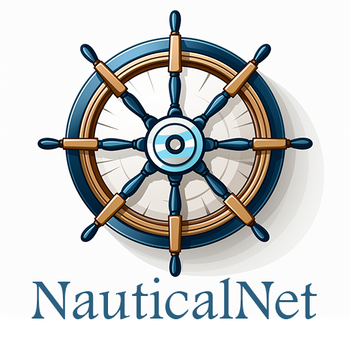

# Nautical-Net

NauticalNet is a Discord bot that provides images from various image search APIs to copy as links within Discord.

This is designed to be used in conjunction with MidJourney to quickly be able to search reference images for your prompts using various APIs.

# Installation

There are two methods of installing the NauticalNet bot on your own discord server. One, is to run it on your own local machine, or on a server. Additionally, another option is to run it as a docker container.

## Local Installation

🛠️ In Process 🛠️

## Docker Installation

🛠️ In Process 🛠️

# Usage

Once the bot has been added to your discord server, you may type `/search-pexels` or `/search-unsplash` and press enter to begin the search command.

You may type any number of descriptions or keywords into the search box. NauticalNet will then search through image database finding results for you. Once completed, you may view the list of results.

You may click on an image to view it larger.

You may also copy the discord temporary link by right clicking on the image and selecting `copy link`. Additionally, you may copy the web URL by right clicking on the blue title above each image and selecting `copy link`
